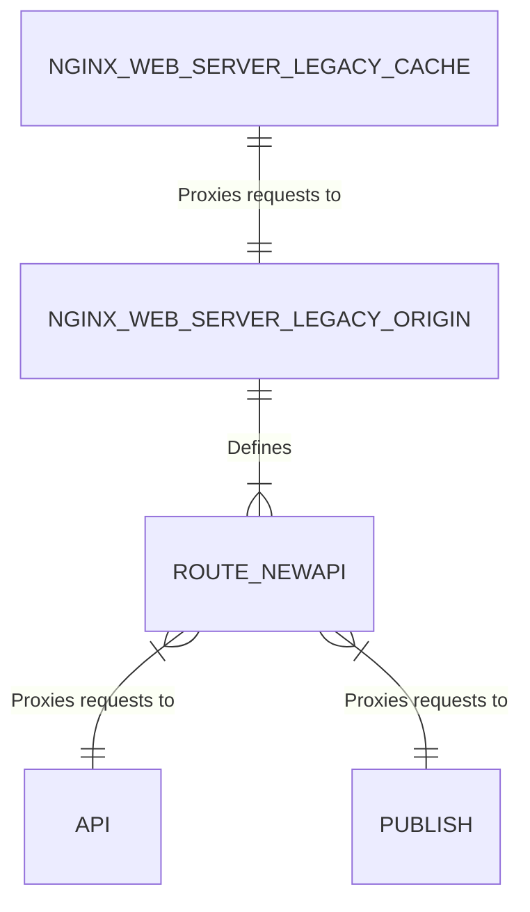

# API for Puzzle Massive and Other Services

`systemd` services defined in this `api/` directory:

- `puzzle-massive-api.service` **API** - Flask app to handle requests
- `puzzle-massive-artist.service` **Artist** - Run the puzzle_create jobs
- `puzzle-massive-backup-db.service` Executes the bin/backup.sh script
- `puzzle-massive-backup-db.timer` Run puzzle-massive-backup-db service every 13 hours
- `puzzle-massive-cache-purge.path` Activate the service if the purge url list file changes.
- `puzzle-massive-cache-purge.service` Purges the cached URLs listed in urls-to-purge.txt
- `puzzle-massive-janitor.service` **Janitor** - Run the puzzle_cleanup jobs
- `puzzle-massive-publish.service` **Publish** - Piece Movement Publish
- `puzzle-massive-scheduler.service` **Scheduler** - Run tasks at predefined intervals

## API Handles `/newapi/*` Requests

The Flask app for API defines all the routes in the `[api/app.py](api/app.py)` file.
The NGINX web server proxies any of the requests for `/newapi/*` to this app.

API er diagram

## Artist

The [api/artist.py](api/artist.py) application listens for jobs on a Redis queue to
start the rendering process of creating puzzle pieces from an image.

## Janitor

The [api/janitor.py](api/janitor.py) application listens for jobs on a Redis queue to
clean up inactive puzzles and handles unsplash image fetch jobs.

## Publish

The Flask app for Publish defines all the routes in the `[api/publish.py](api/publish.py)` file.
The NGINX web server proxies these requests to the Publish app.

- `^/newapi/puzzle/.*/piece/.*/move/`
- `^/newapi/puzzle/.*/piece/.*/token/`

## Scheduler

The Python app that handles scheduled jobs is at
`[api/scheduler.py](api/scheduler.py)`. It handles the below tasks:

- AutoRebuildCompletedPuzzle - Auto rebuild completed puzzles that are no longer recent
- BumpMinimumDotsForPlayers - Increase dots for players that have less then the minimum
- UpdateModifiedDateOnPuzzle - Update the m_date for all recently updated puzzles based on pcupdates redis sorted set
- UpdatePlayer - Update the User points, score, m_date from what has recently been put on redis
- UpdatePuzzleStats - Update the puzzle stats/timeline from what has recently been put on redis
- UpdatePuzzleQueue - Update puzzle queue for original puzzles (not puzzle instances)
- AutoApproveUserNames - Approve user names that have not been approved and have old approved_date.
- SendDigestEmailForAdmin Let admin know of any items of interest via email
