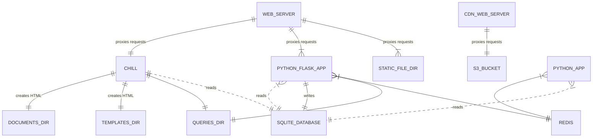

## Overview

overview er diagram

<!-- Too much detail...
CHILL ||..|| SQLITE_DATABASE : "reads from"
CHILL ||..|| QUERIES_DIRECTORY : "uses"
CHILL ||..|| TEMPLATES_DIRECTORY : "uses"
CHILL ||..|| DOCUMENTS_DIRECTORY : "uses"

NGINX_WEB_SERVER**LEGACY_CACHE ||--|| LEGACY_CACHE_NGINX_CONF : "uses configuration file"
NGINX_WEB_SERVER**LEGACY_CACHE ||--|| CACHE_DIR : "Stores responses in a cache directory"
NGINX_WEB_SERVER**LEGACY_CACHE ||--|| NGINX_WEB_SERVER**LEGACY_ORIGIN : "Proxies requests to"
NGINX_WEB_SERVER**LEGACY_ORIGIN ||--|| ROUTE_NEWAPI : "Defines"
NGINX_WEB_SERVER**LEGACY_ORIGIN ||--|| ROUTE_CHILL : "Defines"
ROUTE_CHILL ||--|| CHILL : "Proxies requests to"
-->

## Top Level Directories and Files

`api/` Python Flask app that the client-side app calls to get and modify data.

`bin/` Contains various scripts that are used for deployment and other tasks.

`chill/`, `chill-data/`, `chill-data.sql`, `templates`, and `documents/` are
used by chill app to build various pages on the site.

`design-tokens/` settings that are used for CSS custom properties.

`divulger/` Python app that _was_ used for broadcasting puzzle piece movements via
websocket. The Stream app has replaced this functionality.

`docs/` Any helpful text files and such to help explain this project. Contains
guides on installing and developing Puzzle Massive.

`enforcer/` Python app that is used to enforce puzzle piece stacking rules.

`media/` and `source-media` Holds graphic files and other binaries that are directly used for the
design of the site.

`mockups/` Contains mockup HTML files that show the various components that are
used on the Puzzle Massive site.

`queries/` SQL files that are used by the chill app and api app.

`resources/` Generic directory for files.

`root/` Files that will be served at the root of the site.

`site-specific-content/` Files that are only relevant for separate distributions
of the Puzzle Massive site. This is typically added via a git submodule and the
contents are not part of the main puzzle-massive codebase.

`src/` Client-side source files that are compiled to the `dist/` directory.

`stats/` AWStats (Advanced Web Statistics) setup.

`stream/` The python app that handles sending puzzle piece movements via
server-side events.

`web/` NGINX web server configuration.
