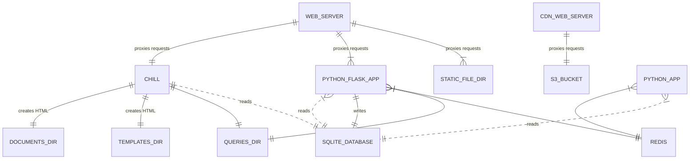

## Overview

overview er diagram

## Top Level Directories and Files

[api/](../api/) Python Flask app that the client-side app calls to get and modify data.

[bin/](../bin/) Contains various scripts that are used for deployment and other tasks.

[chill/](../chill/), [chill-data/](../chill-data/), `chill-data.sql`, [templates/](../templates/), and [documents/](../documents/) are
used by chill app to build various pages on the site.

[design-tokens/](../design-tokens/) settings that are used for CSS custom properties.

`divulger/` Python app that _was_ used for broadcasting puzzle piece movements via
websocket. The Stream app has replaced this functionality.

[docs/](../docs/) Any helpful text files and such to help explain this project. Contains
guides on installing and developing Puzzle Massive.

[enforcer/](../enforcer/) Python app that is used to enforce puzzle piece stacking rules.

`media/` and [source-media/](../source-media/) Holds graphic files and other binaries that are directly used for the
design of the site.

[queries/](../queries/) SQL files that are used by the chill app and api app.

`resources/` Generic directory for files.

`root/` Files that will be served at the root of the site.

`site-specific-content/` Files that are only relevant for separate distributions
of the Puzzle Massive site. This is typically added via a git submodule and the
contents are not part of the main puzzle-massive codebase.

[client-side-public/](../client-side-public/) Client-side source files (JavaScript, CSS, HTML, etc.)

[stats/](../stats/) AWStats (Advanced Web Statistics) setup.

[stream/](../stream/) The python app that handles sending puzzle piece movements via
server-side events.

[web/](../web/) NGINX web server configuration.
