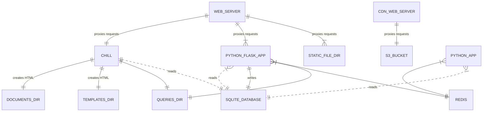

##Overview

overview er diagram

<!-- Too much detail...
CHILL ||..|| SQLITE_DATABASE : "reads from"
CHILL ||..|| QUERIES_DIRECTORY : "uses"
CHILL ||..|| TEMPLATES_DIRECTORY : "uses"
CHILL ||..|| DOCUMENTS_DIRECTORY : "uses"

NGINX_WEB_SERVER**LEGACY_CACHE ||--|| LEGACY_CACHE_NGINX_CONF : "uses configuration file"
NGINX_WEB_SERVER**LEGACY_CACHE ||--|| CACHE_DIR : "Stores responses in a cache directory"
NGINX_WEB_SERVER**LEGACY_CACHE ||--|| NGINX_WEB_SERVER**LEGACY_ORIGIN : "Proxies requests to"
NGINX_WEB_SERVER**LEGACY_ORIGIN ||--|| ROUTE_NEWAPI : "Defines"
NGINX_WEB_SERVER**LEGACY_ORIGIN ||--|| ROUTE_CHILL : "Defines"
ROUTE_CHILL ||--|| CHILL : "Proxies requests to"
-->

## Notes on the top level directories

`api/` Python Flask app that the client-side app calls to get and modify data.

`bin/` Contains various scripts that are used for deployment and other tasks.

`certbot/` Not implemented. For setting up the site for https:// support.

`chill/` App that is used for server-side rendered HTML and serves the static
resources.

`divulger/` Python app used for broadcasting puzzle piece movements via
websockets.

`docs/` Any helpful text files and such to help explain this project.

`documents/` The chill app uses files in here to build various pages on the
site.

`media/` Holds graphic files and other binaries that are directly used for the
design of the site.

`puzzle-massive/` When a `make dist` is run this directory holds symlinks of
files and directories that will be included in a distribution.

`queries/` SQL files that are used by the chill app and api app.

`resources/`

`root/` Files that will be served at the root of the site.

`src/` Client-side source files that are compiled to the `dist/` directory via
webpack.

`stats/`

`templates/` The chill app uses these files when building the pages shown on the
site.

`web/` Nginx configuration.

`dist/`
`frozen/`
`include/`
`lib/`
`local/`
`node_modules/`
`share/`
These directories are part of the build process and can be ignored.

## Other top level files

The below list of top level files are mostly explanatory.

chill-data.sql
CODE_OF_CONDUCT.md
CONTRIBUTING.md
db.dump.sql
LICENSE.txt
Makefile
package.json
port-registry.cfg
README.md
requirements.txt
site.cfg
site.cfg.sh
Vagrantfile
webpack.config.js
